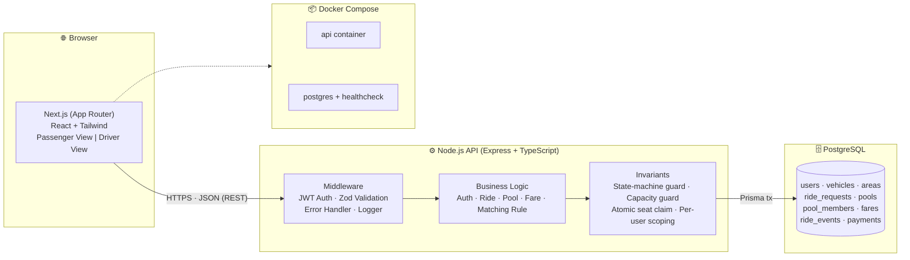
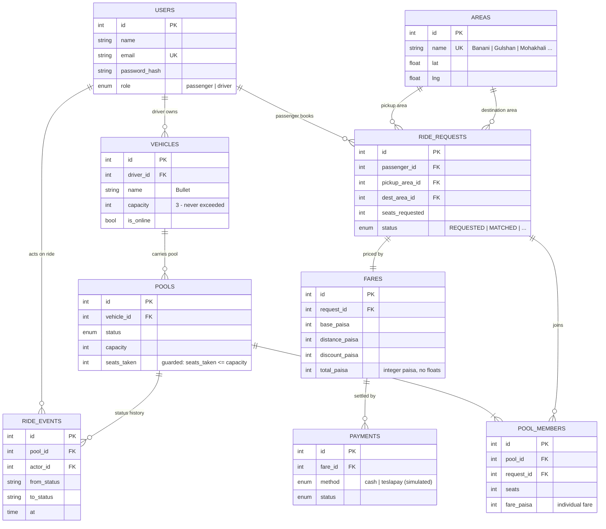
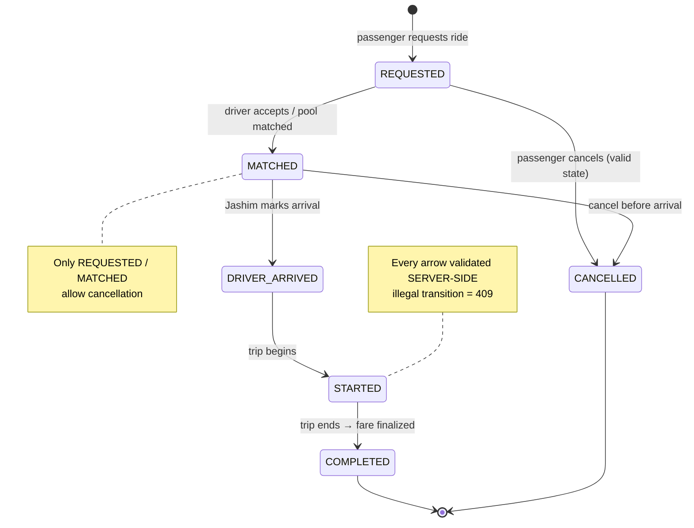
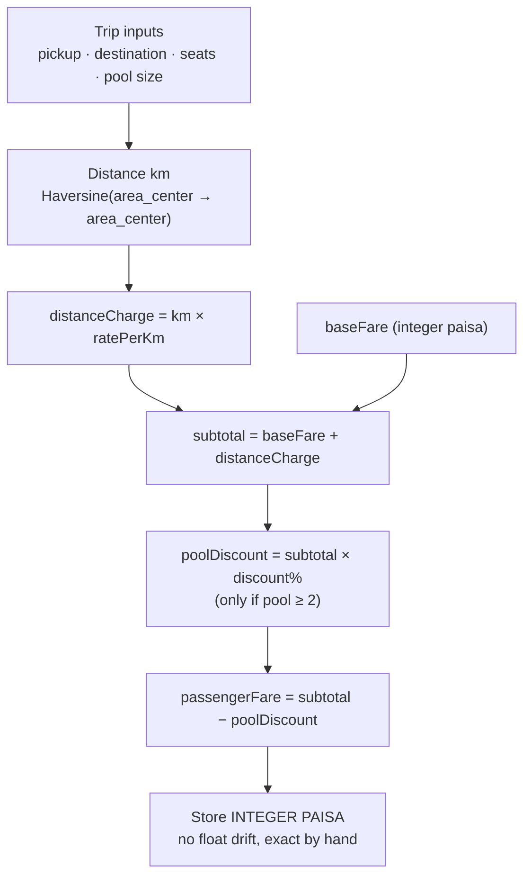
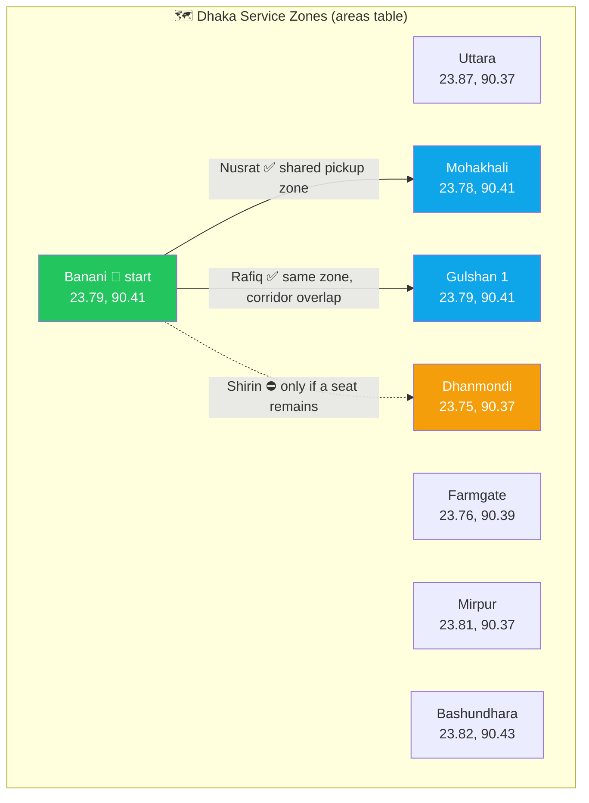

# 2-Day Build Plan — Dhaka Tesla Pool MVP

> Derived from the PRD analysis in [`read.md`](./read.md).
> **Goal:** a complete, defensible MVP in 2 days — not a perfect one.
> **Rule of the 2 days:** build only what you can *explain* in the video and interview.

---

## 0. Strategy Before We Start

**Scope cut (what we DO build)**
- 3 actors: Passenger, Driver, Pool/Ride with the full state machine
- Atomic seat-capacity enforcement (the #1 invariant)
- Hand-testable fare formula (integer paisa)
- Documented matching rule (zone/corridor based, no maps)
- Docker compose up (app + postgres + migrations + seeds + healthcheck)
- The 6 required tests, README with ERD + architecture + AI usage, git history, 6-min video

**Scope cut (what we SKIP)**
- ❌ Real maps/routing, real payments (simulated TeslaPay/Cash only)
- ❌ Redis, Kafka, queues, microservices, Kubernetes
- ❌ Rating system (optional — add only if Day 2 finishes early)
- ❌ Pixel-perfect UI (clean + correct states > pretty)
- ⏸ Scaling bonus → **only** if everything else is done (it's a bonus, README section is enough)

**Non-negotiables (check every 2 hours)**
- [x] No secrets in git (`.env.example` only)
- [x] Every commit: `type(scope): short description`
- [x] Feature branches only — never commit features straight to `master`
- [x] Cast stays consistent: Jashim / Bullet / Nusrat / Rafiq / Shirin
- [x] Each phase ends with **working, committed** code

**DECIDED: No map — Area List only (Option A)**
- UI: pickup/destination = **dropdown of Dhaka areas** (no Leaflet/Google Maps/any map API)
- Backend: `areas` table with `name + lat + lng`; distance via **Haversine formula** (zone-center to zone-center) feeds the fare
- Why: PRD Section 4 recommends exactly this — zero API keys, zero billing risk ("do not pay"), fastest to build, and the evaluator can hand-verify fare from a documented distance table
- Fare estimate shows the breakdown (base / distance km / discount / total) so hand-calculation is easy
- Revisit only if everything else is done — and even then a map is optional polish, never a dependency

**Assumptions to lock in NOW (write into README early)**
1. Matching rule: *same pickup area OR pickup→destination corridor overlap* → eligible to pool (Nusrat + Rafiq match: both Banani pickup, both heading south/east corridor; Shirin matches but only if seats remain).
2. Fare: `total = baseFare + distanceCharge − poolDiscount`, where `poolDiscount = poolDiscount% × (baseFare + distanceCharge)` if seats ≥ 2 occupied. Money stored as **integer paisa** (no float drift, exact hand-checking).
3. Cancellation allowed only in `REQUESTED` or `MATCHED` (before `DRIVER_ARRIVED`).
4. One active pool per vehicle at a time.

---

## Recommended Stack (locked to avoid decision fatigue)

| Layer | Pick | Why (one-liner for README) |
|---|---|---|
| Frontend | **Next.js 14 App Router** | SSR + routing mandated-optional; fastest to clean UI |
| Backend | **Express + TypeScript** | simple, interview-friendly; alternatives: Fastify/NestJS |
| DB | **PostgreSQL 17** | relational integrity for capacity/pooling; row locks for concurrency |
| ORM | **Prisma** | migrations + type safety; alternative: Drizzle/Knex |
| Validation | **Zod** | shared schemas, clear errors |
| Auth | **JWT (access) + bcrypt** | simple, stateless, explainable |
| Tests | **Vitest + Supertest** (+ `docker compose` for concurrency test) | fast, TS-native |
| Styling | **Tailwind CSS** | speed, no bloat |

> If you prefer plain React + Vite or Fastify — fine. **Justify it in README and stay consistent.** Don't switch after Hour 3.

---

## 📐 Diagrams — Ready to Build (Day 1, Hour 1 material)

> Mermaid — renders on GitHub/VS Code preview. **Copy these straight into the README** (PRD §9 requires architecture + ERD) and screen-share them in the video.

### D1. System Architecture
*PRD §9 minimum: Browser → Next.js/React → Node.js API → Database*



**PRD rule:** no microservices, Kafka, K8s, Redis, or queues — one API, one DB.

### D2. ERD — Database Map



### D3. Ride / Pool Lifecycle



### D4. Pooling Sequence — the story (Nusrat + Rafiq + Shirin)

```mermaid
sequenceDiagram
    participant N as 🧍 Nusrat
    participant R as 🧍 Rafiq
    participant S as 🧍 Shirin
    participant A as ⚙️ API
    participant J as 🚗 Jashim / Bullet (3 seats)
    participant D as 🗄️ DB

    N->>A: request Banani → Mohakhali (1 seat)
    A->>D: INSERT ride_request (REQUESTED)
    A-->>N: fare estimate (base + distance − discount)

    R->>A: request Banani → Gulshan 1 (1 seat)
    A->>A: matching rule? same pickup zone + corridor ✅
    A->>D: ATOMIC: UPDATE pools SET seats_taken+1 WHERE seats_taken+1 <= 3
    D-->>A: 1 row updated (seats = 1/3)
    A-->>R: pooled — individual fare

    J->>A: accept pool
    A->>D: REQUESTED → MATCHED (ride_events logged)

    S->>A: request last seat
    A->>D: atomic claim → 3/3 or 409 no seats left
    Note over A,D: 4th request → 409 NO_SEATS

    J->>A: arrived → start → complete
    A->>D: guard each transition, write ride_events
    Note over N,R,S: each passenger sees ONLY their own fare & status
```

### D5. Fare Model (hand-testable — PRD §5)



### D6. Dhaka Zones Map — Option A (no map API)



**Matching rule:** *same pickup area* **OR** *shared corridor* → eligible to pool. Nusrat & Rafiq both start in **Banani** heading south/east → pool allowed; **Shirin** matches but is bounded by remaining seats.

> 📌 **Day 1 Hour 1 checklist:** paste D1 + D2 into `README.md` (they're mandatory), keep D3–D6 for the video and interview.

---

# DAY 1 — Backend + Database + Docker (the hard half)

## ⏱ 09:00 – 10:00 · Hour 1: Blueprint on paper
- [x] Write `README.md` skeleton: Summary, Assumptions (the 4 above), matching rule, fare formula
- [x] Draw **ERD** (Mermaid) and **architecture diagram** (Browser → Next.js/Express → Postgres) *before coding*
- [x] Finalize schema:

```sql
users(id, name, email, password_hash, role[passenger|driver], created_at)
vehicles(id, driver_id→users, name, capacity, plate, is_online)
areas(id, name, lat, lng)                       -- Banani, Gulshan, Mohakhali, ...
ride_requests(id, passenger_id, pickup_area_id, dest_area_id, seats_requested,
              status[REQUESTED|CANCELLED|...], created_at)
pools(id, vehicle_id→vehicles, status, capacity, seats_taken, created_at, started_at, completed_at)
pool_members(id, pool_id, request_id, seats, fare_paisa, status)
fares(id, request_id, base_paisa, distance_paisa, discount_paisa, total_paisa)
ride_events(id, pool_id, actor_id, from_status, to_status, note, at)   -- audit/history
payments(id, fare_id, method[cash|teslapay], status)                    -- simulated
```
- [x] Define allowed transitions map (single source of truth):
  `REQUESTED → MATCHED → DRIVER_ARRIVED → STARTED → COMPLETED`, `REQUESTED|MATCHED → CANCELLED`
- [x] `git init`, create `master`, first `docs(readme): add PRD analysis and blueprint` commit

**✅ End of hour:** diagrams + schema + assumptions exist on disk and in git.

## ⏱ 10:00 – 11:00 · Hour 2: Scaffold + Docker skeleton
- [x] Monorepo: `/frontend` (Next.js), `/backend` (Express+TS), `/db` (optional)
- [x] `backend`: Express + Zod + Prisma init + error-handling middleware + request logging (pino/morgan)
- [x] `.env.example` (DB_URL, JWT_SECRET, PORT…) — **never real values**
- [x] `docker-compose.yml` v1: `postgres` (with volume + healthcheck) + `api` (dev), `db:migrate` + `seed` on start
- [ ] Verify: `docker compose up` → healthy  *(BLOCKED: WSL not installed — needs admin)*
- Commits: `chore(scaffold)`, `build(docker): add compose with postgres and healthcheck`
- **Branch:** do this on `master` (project setup) — feature work starts next hour

**✅ End of hour:** app boots in Docker, DB reachable.

## ⏱ 11:00 – 13:00 · Hours 3–4: `feature/passenger-auth`
- [x] `POST /auth/signup`, `POST /auth/login` (roles: passenger | driver)
- [x] JWT middleware + `requireRole('passenger')` guards
- [x] Zod validation, bcrypt hashing, uniform error envelope `{error: {code, message}}`
- [x] Areas endpoint: `GET /areas` (seed Banani, Gulshan, Mohakhali, Dhanmondi, Mirpur, Uttara, Farmgate, Bashundhara)
- [x] Fare estimate: `GET /rides/estimate?pickup=&dest=&seats=` → returns breakdown (base/distance/discount/total)
- [x] Unit tests: fare formula (Nusrat & Rafiq hand-calculated), auth failures
- Commits: `feat(auth): add signup/login with JWT`, `feat(areas): seed Dhaka areas`, `feat(fare): implement estimate endpoint`, `test(fare): verify Nusrat and Rafiq pooled fares`
- [x] Merge → `master` when green

**✅ End of hour:** can sign up as Nusrat, get a hand-verifiable fare estimate.

## ⏱ 13:00 – 14:00 · Lunch + buffer

## ⏱ 14:00 – 16:30 · Hours 5–6.5: `feature/tesla-pooling` ⭐ (the core)
- [x] `POST /rides` → create `ride_request` (status `REQUESTED`)
- [x] **Matching rule implementation** (documented fn): find *online* vehicles with compatible corridor + free seats
- [x] `POST /pools/:id/join` → **ATOMIC seat claim**:
  ```sql
  BEGIN;
  UPDATE pools SET seats_taken = seats_taken + $n
   WHERE id = $1 AND seats_taken + $n <= capacity AND status = 'OPEN'
   RETURNING *;
  -- 0 rows ⇒ 409 "no seats available"
  COMMIT;
  ```
  (Prisma: `$transaction` + conditional update, or raw SQL — explain in README)
- [x] Driver: `GET /driver/requests` (relevant only), `POST /pools` (open pool), `POST /pools/:id/accept`
- [x] Lifecycle: `POST /pools/:id/arrived | start | complete` with **server-side transition guard** (invalid ⇒ 409/422)
- [x] Authorization: passengers only see **their own** fare/status/membership (`pool_members` scoping middleware)
- [x] Cancellation: only `REQUESTED`/`MATCHED`; releases seats atomically
- [x] `ride_events` written on every transition (history/audit)
- Commits: `feat(pool): enforce Bullet's seat capacity`, `feat(pool): implement corridor matching rule`, `feat(ride): add lifecycle transitions with guard`, `fix(pool): release seats on cancellation`

**✅ End of hour:** full backend lifecycle works via API; capacity cannot be exceeded.

## ⏱ 16:30 – 17:30 · Hour 7: `test/pool-concurrency` + seed
- [x] The 6 required tests:
  1. capacity never exceeded
  2. invalid transitions rejected
  3. Nusrat + Rafiq pooled fares correct
  4. user cannot modify another user's ride
  5. cancellation rules hold
  6. **two concurrent seat claims → exactly one wins** (parallel Supertest `Promise.all` against Dockerized Postgres)
- [x] Seed script with the **story cast**: Jashim + Bullet (3 seats), Nusrat, Rafiq, Shirin (+ demo credentials)
- Commits: `test(pool): add concurrent seat claim test`, `chore(seed): add story cast demo data`

**✅ End of hour:** `npm test` green in Docker.

## ⏱ 17:30 – 18:30 · Hour 8: API docs + Day 1 wrap
- [x] README: API overview table (method, path, auth, description)
- [x] Commit all; merge to `master`
- [ ] Day-1 review: re-run `docker compose up --build` from scratch *(BLOCKED: WSL)*

**🎯 Day 1 exit criteria**
- [x] `docker compose up` → DB + API + migrations + seeds healthy
- [x] All ride/pool/fare/auth endpoints working with guards
- [x] 6 tests passing (incl. concurrency)
- [x] ERD + architecture in README, assumptions documented
- [x] Feature branches merged into `master` with clean history

---

# DAY 2 — Frontend + Tests Polish + Docs + Git Release + Video

## ⏱ 09:00 – 11:30 · Hours 9–10.5: `feature/passenger-ui`
- [ ] Pages: Login/Signup → Request Ride (pickup/dest/seats) → **Fare estimate card** → Live status → History
- [ ] Status tracking with clear states; polling every ~5s (no need for websockets)
- [ ] **Loading / error / empty states** for every async view (explicitly graded)
- [ ] Cancel button only when state allows (mirror backend rule, don't invent rules)
- [ ] Fare shown only for *the current user*
- Commits: `feat(ui): add passenger ride request flow`, `feat(ui): add ride status and history views`, `fix(ui): handle loading and error states`

## ⏱ 11:30 – 13:30 · Hours 11–12: `feature/driver-ui`
- [ ] Driver login → online/offline toggle → incoming compatible requests → open/accept pool → passengers + seat meter (`2/3 seats`) → arrived → start → complete
- [ ] Ride history view for driver
- [ ] Block illegal actions in UI *and* show backend 409s gracefully
- Commits: `feat(ui): add driver online toggle and request feed`, `feat(ui): add pool lifecycle controls`

## ⏱ 13:30 – 14:30 · Lunch + buffer

## ⏱ 14:30 – 15:30 · Hour 13: End-to-end pass + edge case
- [ ] Manual walkthrough as the story: Nusrat books → Rafiq pools → Shirin takes last seat → **Shirin #2 attempt gets rejected (edge case for video)** → Jashim drives → complete → history
- [ ] Fix anything broken; screenshots/GIFs for README **as you go**
- Commits: `fix(...)` as needed (real fix commits = good history)

## ⏱ 15:30 – 16:30 · Hour 14: Deployment
- [ ] Try free tiers: **Vercel** (frontend) + **Railway/Render/Fly** (API + managed Postgres free tier)
- [ ] If blocked by free-tier limits → document the constraint in README + provide reproducible Docker deploy (PRD explicitly allows this)
- [ ] Add deployment URL to README
- Commits: `docs(deploy): add deployment instructions`, `chore(ci)` if time

## ⏱ 16:30 – 17:30 · Hour 15: README completion (do NOT leave this last)
Must have all of these:
- [ ] Summary, problem statement, features, **screenshots/GIFs**
- [ ] Architecture diagram + **ERD**
- [ ] Tech stack, project structure, prerequisites
- [ ] `.env.example` reference (no real secrets)
- [ ] Local setup / Docker / migration / seed instructions
- [ ] Run frontend · run backend · run tests · **demo credentials**
- [ ] Deployment URL, API overview, key decisions & trade-offs, known limitations, next improvements
- [ ] **AI Usage section**: tools used, one *accepted* suggestion, one *rejected/changed* suggestion + why
- [ ] **6-min video link** (placeholder OK until recorded)
- [ ] Bonus scaling section (short is fine — reasoning > boxes)
- Commits: `docs(readme): ...`

## ⏱ 17:30 – 18:15 · Hour 16: Git release ritual ⭐ (graded!)
```bash
# from green master
git checkout -b pre-release
# integration fixes, doc polish, deployment checks
git commit -m "fix(api): align error codes with README"
git commit -m "docs(readme): add AI usage and deployment notes"

git checkout -b release/v1.0.0
git tag -a v1.0.0 -m "Dhaka Tesla Pool MVP v1.0.0"
git checkout master && git merge pre-release
```
- [ ] Verify history looks like a *journey*: multiple feature branches, incremental commits, no giant dump
- [ ] `git status` clean, no `.env` committed, `.gitignore` correct

## ⏱ 18:15 – 19:15 · Hour 17: Record the 6-minute video (Loom, free)
Script timing:
| Time | Content |
|---|---|
| 0:00–1:00 | Your own-words understanding: strangers sharing a 3-seat ride, fair fares, driver clarity — **don't read the PRD** |
| 1:00–3:00 | Architecture + ERD on screen; backend design; state machine; **key decision** = atomic seat claim, **trade-off** = polling vs realtime (or Express vs Nest) |
| 3:00–6:00 | Live tour: passenger request → pool match → Shirin's rejected seat (edge case) → driver lifecycle → fare breakdown → history → deployment |
- [ ] Link prominently at top of README
- Commit: `docs(readme): add demo video link`

## ⏱ 19:15 – 19:45 · Hour 18: Final submission check (from PRD §14)
- [ ] Public repo, working MVP (frontend + backend + DB)
- [ ] `docker compose up` works from a clean clone
- [ ] `.env.example` present, **no secrets**
- [ ] Migrations + seed with story cast
- [ ] Architecture diagram + ERD
- [ ] `master` / `pre-release` / `release/v1.0.0` + meaningful history
- [ ] Tests green, README self-explanatory, deploy link (or documented constraint)
- [ ] Video link + AI Usage section (+ bonus if attempted)
- [ ] Re-read §16 "What NOT to Do" — confirm none violated

**🎯 Day 2 exit criteria**
- [x] Two complete user flows working end-to-end
- [x] Loading/error/empty states present
- [x] README complete with diagrams, AI usage, video
- [x] Release branches + tag cut
- [ ] Rehearse the video once → record → link

---

## Risk Register (2-day realities)

| Risk | Mitigation |
|---|---|
| Time sink on UI polish | Tailwind + existing component patterns; states > styles |
| Prisma + Docker migration issues | Run `prisma migrate dev` locally first; bake `migrate deploy` into container entrypoint |
| Concurrency test flaky | Run against Dockerized Postgres, not SQLite (SQLite locks differently) |
| Free-tier deploy blocked | Document + ship Docker reproducibility (allowed by PRD) |
| README forgotten | Hour 15 is **reserved** for it; screenshots collected during Day 2 |
| Git history looks fake | Commit at every phase end with real scope messages (list above is ready to use) |
| Can't explain AI-written code | Keep the AI Usage log *while* working: 1 accepted + 1 rejected suggestion noted |

## Interview Prep Notes (write while building)
- Why Postgres + row-lock conditional update for capacity? What breaks at 1M users?
- Why integer paisa? What if currency had 3 decimals?
- Show the exact transition guard code.
- What does `ride_events` buy you that `status` alone doesn't?
- Which assumption was riskiest, and what would change it?

---

*Plan is deliberately aggressive — if you fall behind, cut in this order: ① deployment ② bonus scaling ③ screenshots ④ driver history view. Never cut: capacity test, transition guard, README AI usage, video, git branches.*
